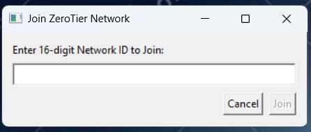

# Access Your Local Server Over the Internet Using ZeroTier VPN

Easily connect to your local server from anywhere using ZeroTier VPN.

This guide will help you set up ZeroTier VPN to access your local server from anywhere over the internet securely. With ZeroTier, you can create a virtual private network (VPN) and connect your devices (e.g., server and PC) with unique private IPs, enabling remote access.

### Prerequisites
- A local server with SSH enabled.

- A PC or another device to connect to the server.
- Internet access on both devices.
- ZeroTier VPN installed on both the server and the client device.

## Step-by-Step Guide

### Install ZeroTier VPN

**On the Server:**

Download and install ZeroTier from the official website:

[https://www.zerotier.com/download/](https://www.zerotier.com/download/#entry-5)

Use the command:

```curl -s https://install.zerotier.com | sudo bash```

Start the ZeroTier service:

```sudo zerotier-cli join <NETWORK_ID>```

---

***You will find <NETWORK_ID> once you login in zero tier.***

---


**On the Client(widnows):**

- Download and install **ZeroTier One.msi** from the official website:

  [https://www.zerotier.com/download/](https://www.zerotier.com/download/#entry-3)

- You will find ZeroTier in systray.
  
  

- Click on Join New Network

  

- Copy your 16 digit netwrok id from ZeroTier Website and paste in box and click on join button

  

---

**Configure the ZeroTier Network**

- Log in to your ZeroTier account and navigate to the network settings.

  

- Authorize both the server and client devices by approving their ZeroTier-assigned addresses in the "Members" section.

  

- Note the IPs assigned to both devices (e.g., 192.168.x.x).


**Test Connectivity**

On the client device, ping the server using its ZeroTier-assigned IP:

```ping 192.168.x.x```

If successful, connect via SSH:

```ssh user@192.168.x.x```

Replace user with your server username and 192.168.x.x with the server's IP.
